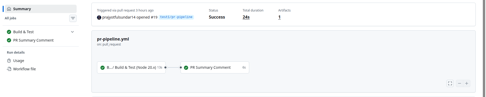
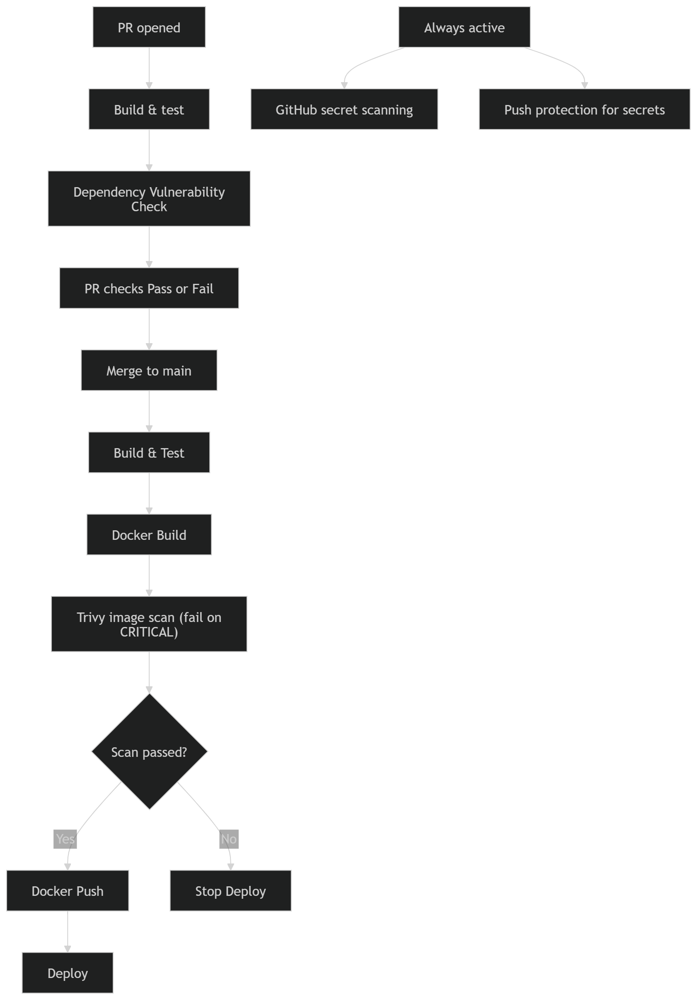

# Day 49 – DevSecOps: Add Security to Your CI/CD Pipeline

## What is DevSecOps?

Think of it like this:

**Without DevSecOps:**
> You build the app → deploy it → a security team finds a vulnerability weeks later → you scramble to fix it

**With DevSecOps:**
> You open a PR → the pipeline automatically checks for vulnerabilities → you fix it before it ever gets merged

**That's it.** DevSecOps = adding security checks to the pipeline you already have. Not a separate process — just a few extra steps.

---

## Key Principles (Keep These in Mind)

1. **Catch problems early** — A vulnerability found in a PR takes 5 minutes to fix. The same vulnerability found in production takes days.

2. **Automate the checks** — Don't rely on someone remembering to check. Let the pipeline do it every time.

3. **Block on critical issues** — If a scan finds a serious vulnerability, the pipeline should fail — just like a failing test.

4. **Never put secrets in code** — Use GitHub Secrets (you learned this on Day 44). No `.env` files, no hardcoded API keys.

5. **Give only the access needed** — Your workflow doesn't need write access to everything. Limit permissions.

---

## Challenge Tasks

### Task 1: Scan Your Docker Image for Vulnerabilities
Your Docker image might use a base image with known security issues. Let's find out.

Add this step to your main branch pipeline (after Docker build, before deploy):
```yaml
- name: Scan Docker Image for Vulnerabilities
  uses: aquasecurity/trivy-action@master
  with:
    image-ref: 'your-username/your-app:latest'
    format: 'table'
    exit-code: '1'
    severity: 'CRITICAL,HIGH'
```

What this does:
- `trivy` scans your Docker image for known CVEs (Common Vulnerabilities and Exposures)
- `format: 'table'` prints a readable table in the logs
- `exit-code: '1'` means **fail the pipeline** if CRITICAL or HIGH vulnerabilities are found
- If it passes, your image is clean — proceed to push and deploy

Push and check the Actions tab. Read the scan output.

**Verify:** Can you see the vulnerability table in the logs? Did it pass or fail?


- Fail — vulnerabilities were detected.

- What CVEs (if any) were found? What base image are you using?

- CVEs found:
    CVE-2026-22184, CVE-2024-21538, CVE-2025-64756, CVE-2026-26996, CVE-2026-27903, CVE-2026-27904, CVE-2026-23745, CVE-2026-23950, CVE-2026-24842, CVE-2026-26960, CVE-2026-29786, CVE-2026-31802.

- Base image: Alpine Linux (node:alpine). then change to node:22-bookworm-slim


#### Vulnerability & Secrets Report

| Target                                               | Type     | Vulnerabilities | Secrets |
|-----------------------------------------------------|---------|----------------|---------|
| sanketdangat11/node-app:sha-4d951ac (debian 12.13) | debian  | 0              | -       |
| app/node_modules/@isaacs/cliui/package.json         | node-pkg| 0              | -       |
| app/node_modules/@isaacs/fs-minipass/package.json   | node-pkg| 0              | -       |
| app/node_modules/accepts/package.json               | node-pkg| 0              | -       |
| app/node_modules/balanced-match/package.json       | node-pkg| 0              | -       |
| app/node_modules/body-parser/package.json          | node-pkg| 0              | -       |
| app/node_modules/brace-expansion/package.json      | node-pkg| 0              | -       |
| app/node_modules/bytes/package.json                | node-pkg| 0              | -       |
| app/node_modules/call-bind-apply-helpers/package.json | node-pkg| 0          | -       |
| app/node_modules/call-bound/package.json           | node-pkg| 0              | -       |
| app/node_modules/chownr/package.json               | node-pkg| 0              | -       |
| app/node_modules/content-disposition/package.json  | node-pkg| 0              | -       |
| app/node_modules/content-type/package.json         | node-pkg| 0              | -       |
| app/node_modules/cookie-signature/package.json     | node-pkg| 0              | -       |
| app/node_modules/cookie/package.json               | node-pkg| 0              | -       |
| app/node_modules/cross-spawn/package.json          | node-pkg| 0              | -       |
| app/node_modules/debug/package.json                | node-pkg| 0              | -       |
| app/node_modules/depd/package.json                 | node-pkg| 0              | -       |
| app/node_modules/dunder-proto/package.json         | node-pkg| 0              | -       |
| app/node_modules/ee-first/package.json             | node-pkg| 0              | -       |
| app/node_modules/encodeurl/package.json            | node-pkg| 0              | -       |
| app/node_modules/es-define-property/package.json   | node-pkg| 0              | -       |
| app/node_modules/es-errors/package.json            | node-pkg| 0              | -       |
| app/node_modules/es-object-atoms/package.json      | node-pkg| 0              | -       |
| app/node_modules/escape-html/package.json          | node-pkg| 0              | -       |
| app/node_modules/etag/package.json                 | node-pkg| 0              | -       |
| app/node_modules/express/package.json              | node-pkg| 0              | -       |
| app/node_modules/finalhandler/package.json         | node-pkg| 0              | -       |
| app/node_modules/foreground-child/package.json     | node-pkg| 0              | -       |
| app/node_modules/forwarded/package.json            | node-pkg| 0              | -       |
| app/node_modules/fresh/package.json                | node-pkg| 0              | -       |
| app/node_modules/function-bind/package.json        | node-pkg| 0              | -       |
| app/node_modules/get-intrinsic/package.json        | node-pkg| 0              | -       |
| app/node_modules/get-proto/package.json            | node-pkg| 0              | -       |
| app/node_modules/glob/package.json                 | node-pkg| 0              | -       |
| app/node_modules/gopd/package.json                 | node-pkg| 0              | -       |
| app/node_modules/has-symbols/package.json          | node-pkg| 0              | -       |
| app/node_modules/hasown/package.json               | node-pkg| 0              | -       |
| app/node_modules/http-errors/package.json          | node-pkg| 0              | -       |
| app/node_modules/iconv-lite/package.json           | node-pkg| 0              | -       |
| app/node_modules/inherits/package.json             | node-pkg| 0              | -       |
| app/node_modules/ipaddr.js/package.json            | node-pkg| 0              | -       |
| app/node_modules/is-promise/package.json           | node-pkg| 0              | -       |
| app/node_modules/isexe/package.json                | node-pkg| 0              | -       |
| app/node_modules/jackspeak/package.json            | node-pkg| 0              | -       |
| app/node_modules/lru-cache/package.json            | node-pkg| 0              | -       |
| app/node_modules/math-intrinsics/package.json      | node-pkg| 0              | -       |
| app/node_modules/media-typer/package.json          | node-pkg| 0              | -       |
| app/node_modules/merge-descriptors/package.json    | node-pkg| 0              | -       |
| app/node_modules/mime-db/package.json              | node-pkg| 0              | -       |
| app/node_modules/mime-types/package.json           | node-pkg| 0              | -       |
| app/node_modules/minimatch/package.json            | node-pkg| 0              | -       |
| app/node_modules/minipass/package.json             | node-pkg| 0              | -       |
| app/node_modules/minizlib/package.json             | node-pkg| 0              | -       |
| app/node_modules/ms/package.json                   | node-pkg| 0              | -       |
| app/node_modules/negotiator/package.json           | node-pkg| 0              | -       |
| app/node_modules/object-inspect/package.json       | node-pkg| 0              | -       |
| app/node_modules/on-finished/package.json          | node-pkg| 0              | -       |
| app/node_modules/once/package.json                 | node-pkg| 0              | -       |
| app/node_modules/package-json-from-dist/package.json | node-pkg| 0           | -       |
| app/node_modules/parseurl/package.json             | node-pkg| 0              | -       |
| app/node_modules/path-key/package.json             | node-pkg| 0              | -       |
| app/node_modules/path-scurry/package.json          | node-pkg| 0              | -       |
| app/node_modules/path-to-regexp/package.json       | node-pkg| 0              | -       |
| app/node_modules/proxy-addr/package.json           | node-pkg| 0              | -       |
| app/node_modules/qs/package.json                   | node-pkg| 0              | -       |
| app/node_modules/range-parser/package.json         | node-pkg| 0              | -       |
| app/node_modules/raw-body/package.json             | node-pkg| 0              | -       |
| app/node_modules/router/package.json               | node-pkg| 0              | -       |
| app/node_modules/safer-buffer/package.json         | node-pkg| 0              | -       |
| app/node_modules/send/package.json                 | node-pkg| 0              | -       |
| app/node_modules/serve-static/package.json         | node-pkg| 0              | -       |
| app/node_modules/setprototypeof/package.json       | node-pkg| 0              | -       |
| app/node_modules/shebang-command/package.json      | node-pkg| 0              | -       |
| app/node_modules/shebang-regex/package.json        | node-pkg| 0              | -       |
| app/node_modules/side-channel-list/package.json    | node-pkg| 0              | -       |
| app/node_modules/side-channel-map/package.json     | node-pkg| 0              | -       |
| app/node_modules/side-channel-weakmap/package.json | node-pkg| 0              | -       |
| app/node_modules/side-channel/package.json         | node-pkg| 0              | -       |
| app/node_modules/signal-exit/package.json          | node-pkg| 0              | -       |
| app/node_modules/statuses/package.json             | node-pkg| 0              | -       |
| app/node_modules/tar/package.json                  | node-pkg| 0              | -       |
| app/node_modules/toidentifier/package.json         | node-pkg| 0              | -       |
| app/node_modules/type-is/package.json              | node-pkg| 0              | -       |
| app/node_modules/unpipe/package.json               | node-pkg| 0              | -       |
| app/node_modules/vary/package.json                 | node-pkg| 0              | -       |
| app/node_modules/which/package.json                | node-pkg| 0              | -       |
| app/node_modules/wrappy/package.json               | node-pkg| 0              | -       |
| app/node_modules/yallist/package.json              | node-pkg| 0              | -       |

---

### Task 2: Enable GitHub's Built-in Secret Scanning
GitHub can automatically detect if someone pushes a secret (API key, token, password) to your repo.

1. Go to your repo → Settings → **Code security and analysis**
2. Enable **Secret scanning**
3. If available, also enable **Push protection** — this blocks the push entirely if a secret is detected

That's it — no workflow changes needed. GitHub does this automatically.


  

Write in your notes:
- What is the difference between secret scanning and push protection?
  
  `secret scanning`  
  - Monitors your repository’s commit history and pull requests for accidentally committed secrets (like API keys, tokens, passwords).
  - Sends alerts or notifications if any secret is detected after the push.

  `push protection`
  - Works before the push is accepted.
  - Blocks commits or pushes entirely if a secret is detected in the pushed code, preventing secrets from entering the repository at all.

- What happens if GitHub detects a leaked AWS key in your repo?
  - Secret scanning detects the AWS key in your commits or pull requests.
  - GitHub alerts you and the key’s provider (AWS) about the potential leak.


---

### Task 3: Scan Dependencies for Known Vulnerabilities
If your app uses packages (pip, npm, etc.), those packages might have known vulnerabilities.

Add this to your **PR pipeline** (not the main pipeline):
```yaml
- name: Check Dependencies for Vulnerabilities
  uses: actions/dependency-review-action@v4
  with:
    fail-on-severity: critical
```

This checks any **new** dependencies added in the PR against a vulnerability database. If a dependency has a critical CVE, the PR check fails.

Test it:
1. Open a PR that adds a package to your app
2. Check the Actions tab — did the dependency review run?

**Verify:** Does the dependency review show up as a check on your PR?

- Yes 

  

---

### Task 4: Add Permissions to Your Workflows
By default, workflows get broad permissions. Lock them down.

Add this block near the top of your workflow files (after `on:`):
```yaml
permissions:
  contents: read
```

If a workflow needs to comment on PRs, add:
```yaml
permissions:
  contents: read
  pull-requests: write
```

Update at least 2 of your existing workflow files with a `permissions` block.

Write in your notes: Why is it a good practice to limit workflow permissions? What could go wrong if a compromised action has write access to your repo?

- limiting workflow permissions is good practice because it reduces the risk if a workflow or action is compromised.

- If a malicious action has write access, it could modify your code, steal secrets, push unauthorized changes, or even delete branches—essentially taking control of your repo.


---

### Task 5: See the Full Secure Pipeline
Look at what your pipeline does now:

```
PR opened
  → build & test
  → dependency vulnerability check     ← NEW (Day 49)
  → PR checks pass or fail

Merge to main
  → build & test
  → Docker build
  → Trivy image scan (fail on CRITICAL) ← NEW (Day 49)
  → Docker push (only if scan passes)
  → deploy

Always active
  → GitHub secret scanning              ← NEW (Day 49)
  → push protection for secrets         ← NEW (Day 49)
```

Draw this diagram in your notes. You just built a **DevSecOps pipeline** — security is now part of your automation, not an afterthought.

  

---

Secret scanning detects sensitive data (like API keys or passwords) accidentally committed to code, preventing leaks.

Dependency review analyzes project libraries to catch vulnerabilities, outdated packages, or risky changes before they’re merged.

---


DevSecOps means including security in every step of making and running software. Developers, security teams, and operations work together to find and fix security problems early. This helps create safer software faster.
