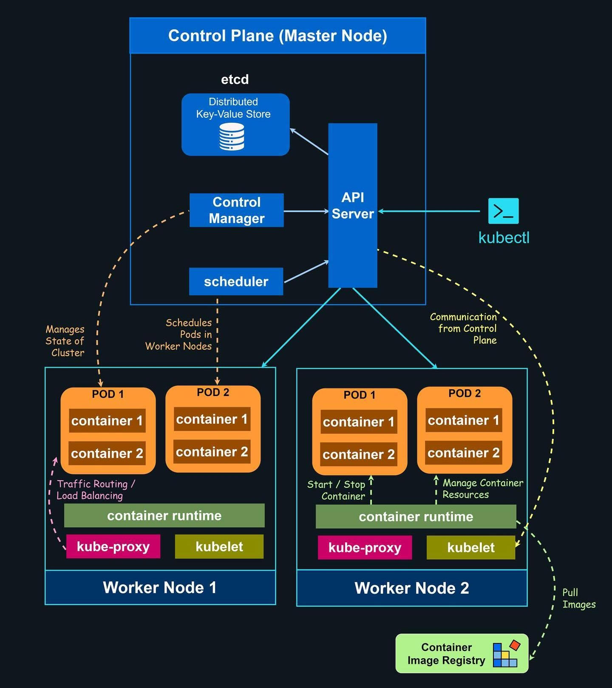
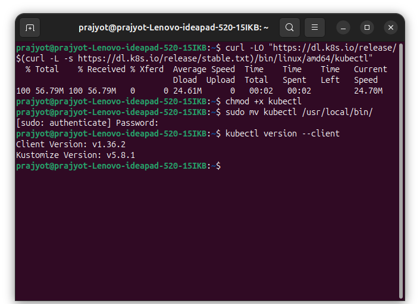
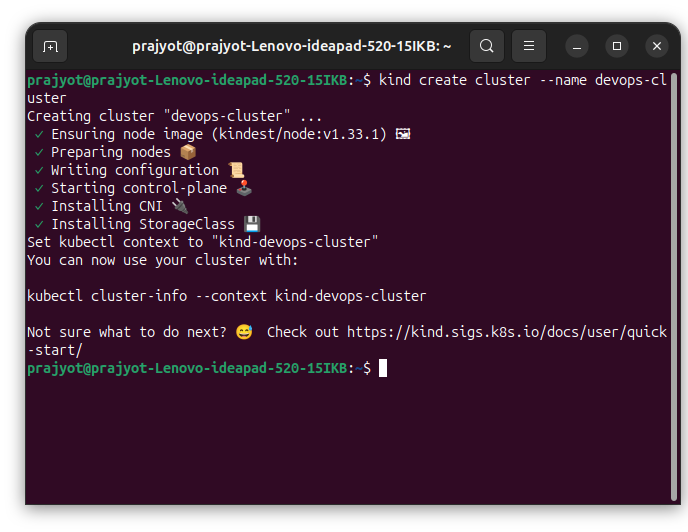
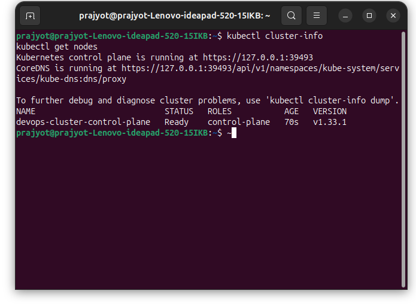
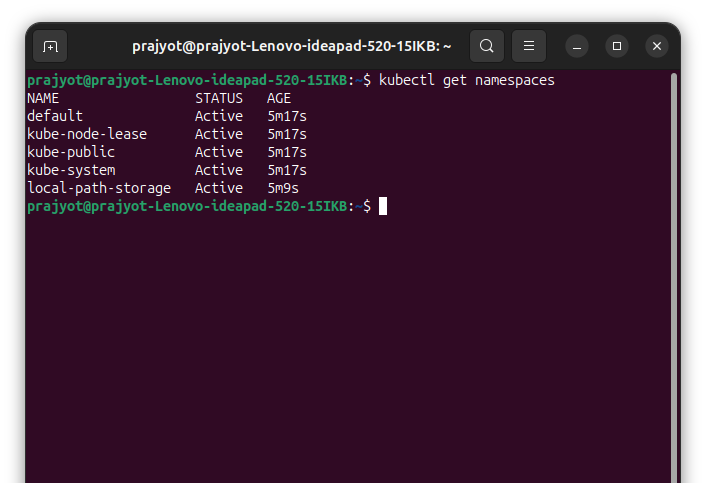
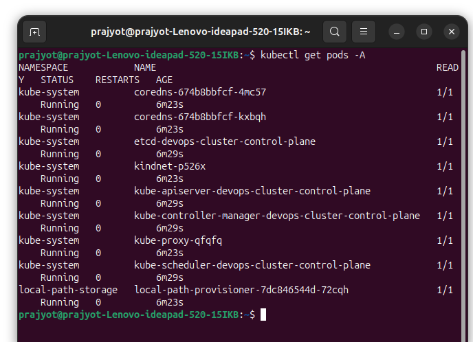
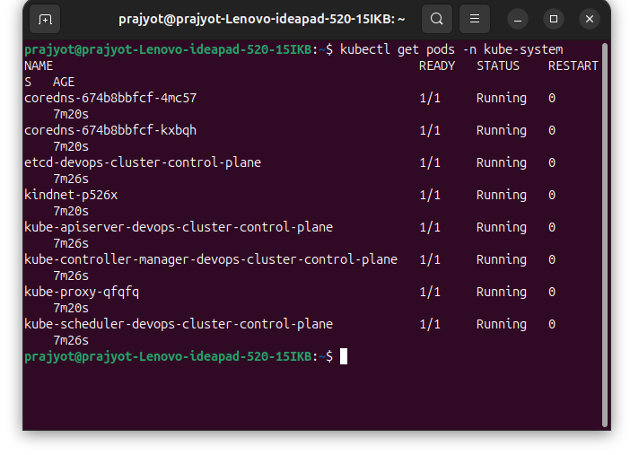
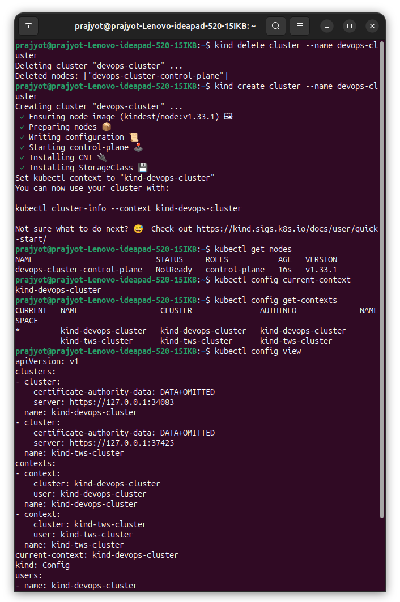

# Day 50 – Kubernetes Architecture and Cluster Setup
## Challenge Tasks

### Task 1: Recall the Kubernetes Story
1. Why was Kubernetes created? What problem does it solve that Docker alone cannot?

 Kubernetes was developed to address the challenges of managing containers at large scale.
- Docker allows to build and run containers,but it mainly focuses on running containers on a single machine.
- When applications grow and require many containers running across multiple servers, managing them manually becomes difficult. Tasks like scaling containers, restarting failed ones
- Kubernetes solves these issues by acting as a container orchestration system, which can automatically:
   - Scale containers based on demand
   - Restart containers when they fail
   - Manage and schedule containers across multiple machines
- In short, Docker runs containers, while Kubernetes manages large numbers of containers across a cluster of servers.


2. Who created Kubernetes and what was it inspired by?
- Google introduced Kubernetes in 2014.
- The project was inspired by Borg,an internal system used by Google to manage containers at massive scale. Borg could automatically handle tasks such as scaling and restarting containers.
- Google later released Kubernetes as an open-source project. Today it is maintained by the Cloud Native Computing Foundation, which is part of the Linux Foundation.

3. What does the name "Kubernetes" mean?
- The name Kubernetes comes from a Greek word meaning “helmsman” or “ship pilot.” It refers to someone who steers a ship.
- This name reflects the role of Kubernetes, which guides and manages containers, similar to how a helmsman controls a ship.
- Kubernetes is often shortened to K8s, where the number 8 represents the eight letters between K and S.

---

### Task 2: Draw the Kubernetes Architecture
From memory, draw or describe the Kubernetes architecture. Your diagram should include:

**Control Plane (Master Node):**
- API Server — the front door to the cluster, every command goes through it
- etcd — the database that stores all cluster state
- Scheduler — decides which node a new pod should run on
- Controller Manager — watches the cluster and makes sure the desired state matches reality

**Worker Node:**
- kubelet — the agent on each node that talks to the API server and manages pods
- kube-proxy — handles networking rules so pods can communicate
- Container Runtime — the engine that actually runs containers (containerd, CRI-O)


    


After drawing, verify your understanding:
- What happens when you run `kubectl apply -f pod.yaml`? Trace the request through each component.

  1. kubectl reads the pod.yaml file.
  2. The request is sent to the Kubernetes API Server.
  3. API Server performs: Authentication, Authorization
  4. If valid, the Pod object is stored in etcd.
  5. The Kubernetes Scheduler detects the unscheduled Pod and assigns it to a node.
  6. The kubelet on that node sees the Pod and instructs the container runtime (e.g., containerd) to start the container.
  7. The container starts and the Pod status is updated to Running in the API Server.


- What happens if the API server goes down?
  - You cannot run kubectl commands or make changes to the cluster.
  - Running pods and services continue working, but no new deployments or scheduling happen.

- What happens if a worker node goes down?
  - Pods on that node stop running.
  - Kubernetes detects the failure and reschedules those pods on other healthy nodes.
---

### Task 3: Install kubectl
`kubectl` is the CLI tool you will use to talk to your Kubernetes cluster.

```bash
# Linux (amd64)
curl -LO "https://dl.k8s.io/release/$(curl -L -s https://dl.k8s.io/release/stable.txt)/bin/linux/amd64/kubectl"
chmod +x kubectl
sudo mv kubectl /usr/local/bin/
```

Verify:
```bash
kubectl version --client
```



---

### Task 4: Set Up Your Local Cluster

# kind (Kubernetes in Docker)

# Create a cluster
kind create cluster --name devops-cluster




# Verify
```bash
kubectl cluster-info
kubectl get nodes
```



**The cluster initialized successfully, and the control plane node became Ready.**
```bash
Cluster endpoint: https://127.0.0.1:36955
Node name: devops-cluster-control-plane
Role: control-plane
Kubernetes version: v1.35.0
```
Which one did you choose and why?
- I chose **KIND (Kubernetes IN Docker)** because it is lightweight and easy to set up for local testing. 
- It runs a **Kubernetes** cluster inside Docker containers,so I can quickly create and delete clusters without needing VMs or a cloud environment.
- This makes it ideal for **development, CI testing, and experimenting with Kubernetes features**.


### Task 5: Explore Your Cluster
Now that your cluster is running, explore it:

# See cluster info
kubectl cluster-info
# List all nodes
kubectl get nodes


# Get detailed info about your node
```bash
kubectl describe node devops-cluster-control-plane
```

This **kubectl** command in **Kubernetes** shows **detailed information about the node** `devops-cluster-control-plane`, including its status,resources,conditions,running pods and events.

# List all namespaces
```bash
kubectl get namespaces
```


# See ALL pods running in the cluster (across all namespaces)
```bash
kubectl get pods -A
```




**kube-system**
Contains core Kubernetes system components such as:

* **CoreDNS** – cluster DNS service
* **etcd** – cluster key-value database
* **kube-apiserver** – API server for the cluster
* **kube-controller-manager** – manages controllers
* **kube-scheduler** – schedules pods to nodes
* **kube-proxy** – manages networking rules
* **kindnet** – networking plugin

**local-path-storage**

* **local-path-provisioner** – provides dynamic local storage for pods.

### Status

All pods show **READY 1/1** and **STATUS Running**, meaning the cluster components are working correctly.


Look at the pods running in the `kube-system` namespace:
```bash
kubectl get pods -n kube-system
```



### Kubernetes System Pods

| Pod Name | Purpose |
|---|---|
| coredns | Provides DNS services so pods can communicate using service names. |
| etcd-devops-cluster-control-plane | Distributed key-value store that holds all cluster configuration and state. |
| kindnet | Networking plugin used by KIND to enable pod networking. |
| kube-apiserver-devops-cluster-control-plane | Main API server that handles all Kubernetes API requests. |
| kube-controller-manager-devops-cluster-control-plane | Runs controllers that manage cluster state such as nodes, replicas, and endpoints. |
| kube-proxy | Manages network rules and enables service networking for pods. |
| kube-scheduler-devops-cluster-control-plane | Assigns newly created pods to available nodes. |


### Status

**READY 1/1**: All containers inside the pod are running.

**STATUS Running**: Pod is functioning correctly.

**RESTARTS 0**: No container crashes occurred.

**AGE 30m**: Pod has been running for 30 minutes.

---

### Task 6: Practice Cluster Lifecycle
Build muscle memory with cluster operations:

```bash
# Delete your cluster
kind delete cluster --name devops-cluster
# (or: minikube delete)

# Recreate it
kind create cluster --name devops-cluster
# (or: minikube start)

# Verify it is back
kubectl get nodes
```

Try these useful commands:
```bash
# Check which cluster kubectl is connected to
kubectl config current-context

# List all available contexts (clusters)
kubectl config get-contexts

# See the full kubeconfig
kubectl config view
```





**What is a kubeconfig? Where is it stored on your machine?**
- kubeconfig is a configuration file used by Kubernetes clients kubectl to connect to a Kubernetes cluster.
- It stores cluster details, user credentials, and contexts.
- Location: ~/.kube/config