# Day 52 – Kubernetes Namespaces and Deployments

## Challenge Tasks

### Task 1: Explore Default Namespaces
Kubernetes comes with built-in namespaces. List them:

```bash
kubectl get namespaces
```

You should see at least:
- `default` — where your resources go if you do not specify a namespace
- `kube-system` — Kubernetes internal components (API server, scheduler, etc.)
- `kube-public` — publicly readable resources
- `kube-node-lease` — node heartbeat tracking

Check what is running inside `kube-system`:
```bash
kubectl get pods -n kube-system
```

These are the control plane components keeping your cluster alive. Do not touch them.

**Verify:** How many pods are running in `kube-system`? `12 Pods are running`

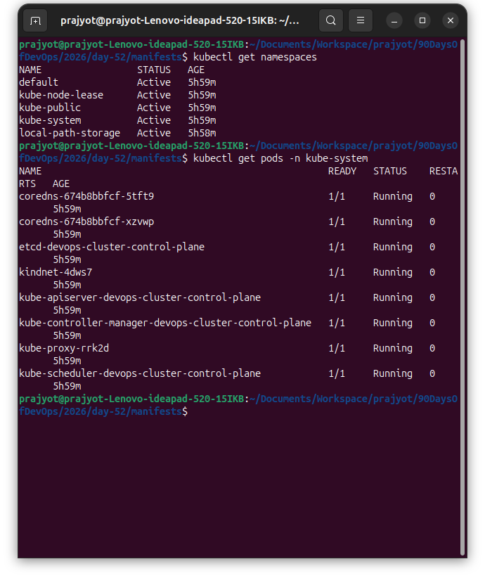

---

### Task 2: Create and Use Custom Namespaces
Create two namespaces — one for a development environment and one for staging:

```bash
kubectl create namespace dev
kubectl create namespace staging
```

Verify they exist:
```bash
kubectl get namespaces
```

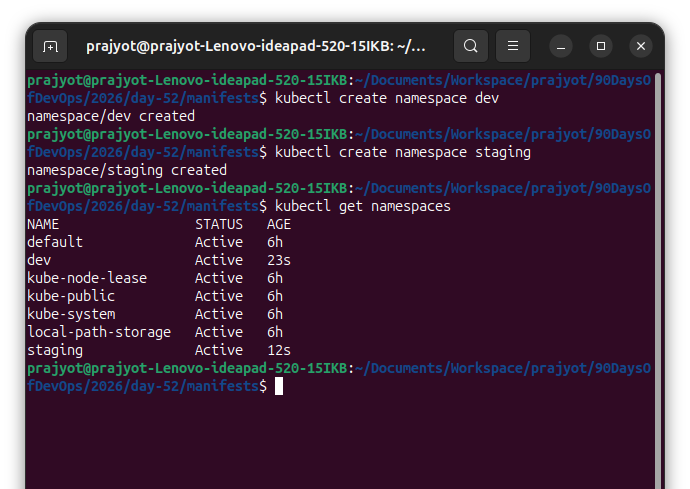

You can also create a namespace from a manifest:
```yaml
# namespace.yaml
apiVersion: v1
kind: Namespace
metadata:
  name: production
```

```bash
kubectl apply -f namespace.yaml
```
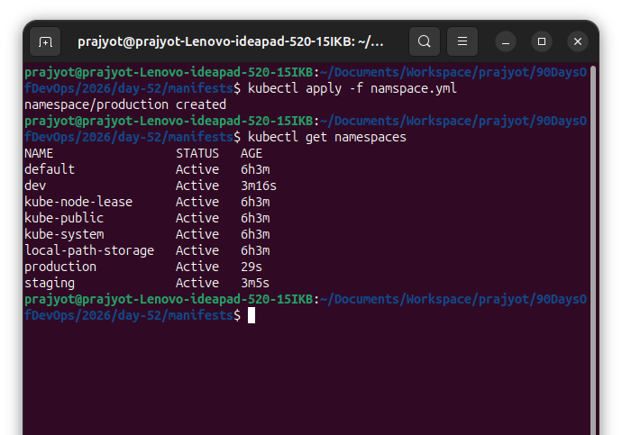


Now run a pod in a specific namespace:
```bash
kubectl run nginx-dev --image=nginx:latest -n dev
kubectl run nginx-staging --image=nginx:latest -n staging
```

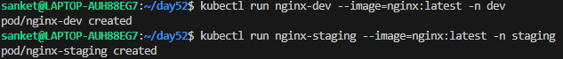

List pods across all namespaces:
```bash
kubectl get pods -A
```

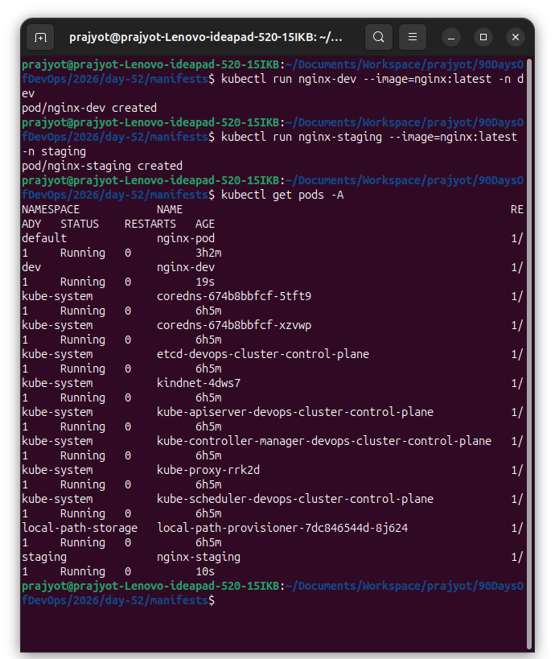

Notice that `kubectl get pods` without `-n` only shows the `default` namespace. You must specify `-n <namespace>` or use `-A` to see everything.

**Verify:** Does `kubectl get pods` show these pods? What about `kubectl get pods -A`?
- When I run `kubectl get pods`,it does not show any pods.
- When I run `kubectl get pods -A` it shows the pods.

---

### Task 3: Create Your First Deployment
A Deployment tells Kubernetes: "I want X replicas of this Pod running at all times." If a Pod crashes, the Deployment controller recreates it automatically.

Create a file `nginx-deployment.yaml`:

```yaml
apiVersion: apps/v1
kind: Deployment
metadata:
  name: nginx-deployment
  namespace: dev
  labels:
    app: nginx
spec:
  replicas: 3
  selector:
    matchLabels:
      app: nginx
  template:
    metadata:
      labels:
        app: nginx
    spec:
      containers:
      - name: nginx
        image: nginx:1.24
        ports:
        - containerPort: 80
```

Key differences from a standalone Pod:
- `kind: Deployment` instead of `kind: Pod`
- `apiVersion: apps/v1` instead of `v1`
- `replicas: 3` tells Kubernetes to maintain 3 identical pods
- `selector.matchLabels` connects the Deployment to its Pods
- `template` is the Pod template — the Deployment creates Pods using this blueprint

Apply it:
```bash
kubectl apply -f nginx-deployment.yaml
```

Check the result:
```bash
kubectl get deployments -n dev
kubectl get pods -n dev
```

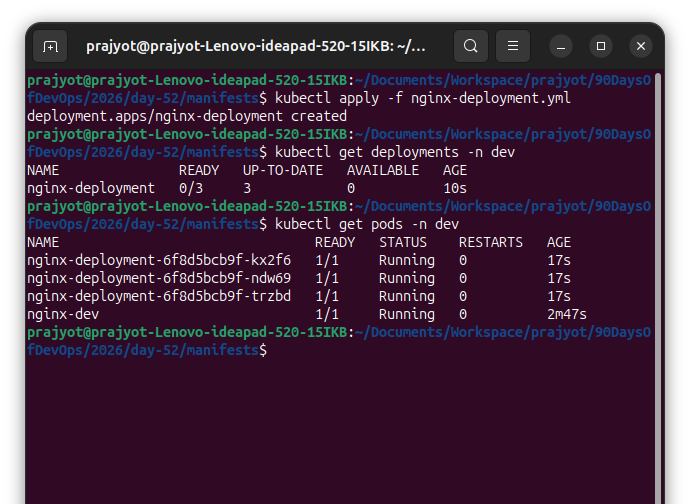

You should see 3 pods with names like `nginx-deployment-xxxxx-yyyyy`.

**Verify:** What do the READY, UP-TO-DATE, and AVAILABLE columns mean in the deployment output?

**READY:** Pods ready to serve traffic (ready/desired)

**UP-TO-DATE:**  Pods using the latest deployment spec

**AVAILABLE:** Pods ready and stable

---

### Task 4: Self-Healing — Delete a Pod and Watch It Come Back
This is the key difference between a Deployment and a standalone Pod.

```bash
# List pods
kubectl get pods -n dev

# Delete one of the deployment's pods (use an actual pod name from your output)
kubectl delete pod <pod-name> -n dev

# Immediately check again
kubectl get pods -n dev
```

The Deployment controller detects that only 2 of 3 desired replicas exist and immediately creates a new one. The deleted pod is replaced within seconds.

**Verify:** Is the replacement pod's name the same as the one you deleted, or different?

- Yes,different name but same prefix

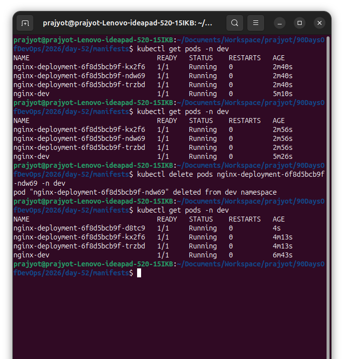

---

### Task 5: Scale the Deployment
Change the number of replicas:

```bash
# Scale up to 5
kubectl scale deployment nginx-deployment --replicas=5 -n dev
kubectl get pods -n dev

# Scale down to 2
kubectl scale deployment nginx-deployment --replicas=2 -n dev
kubectl get pods -n dev
```

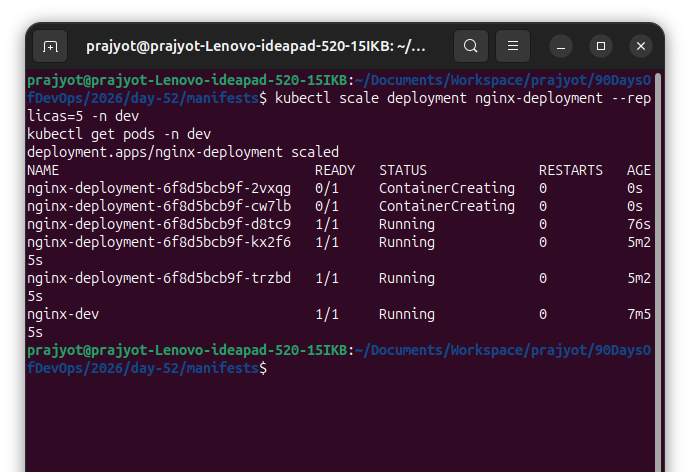


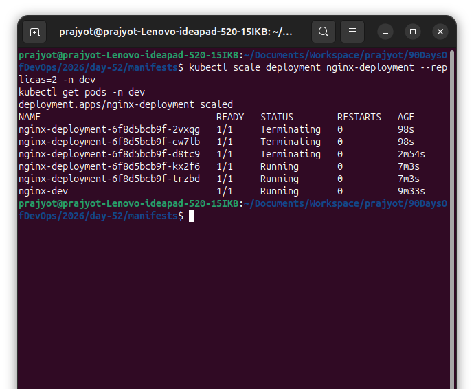

Watch how Kubernetes creates or terminates pods to match the desired count.

You can also scale by editing the manifest — change `replicas: 4` in your YAML file and run `kubectl apply -f nginx-deployment.yaml` again.

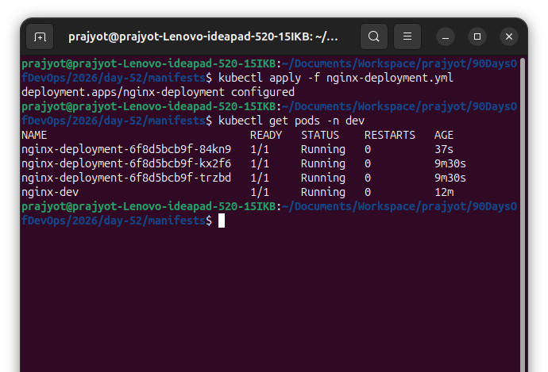

**Verify:** When you scaled down from 5 to 2, what happened to the extra pods?

- The extra pods are terminated automatically.
- Kubernetes keeps only the desired number of replicas (2) and removes the remaining 3 pods to match that state.

---

### Task 6: Rolling Update
Update the Nginx image version to trigger a rolling update:

```bash
kubectl set image deployment/nginx-deployment nginx=nginx:1.25 -n dev
```

Watch the rollout in real time:
```bash
kubectl rollout status deployment/nginx-deployment -n dev
```

Kubernetes replaces pods one by one — old pods are terminated only after new ones are healthy. This means zero downtime.

Check the rollout history:
```bash
kubectl rollout history deployment/nginx-deployment -n dev
```

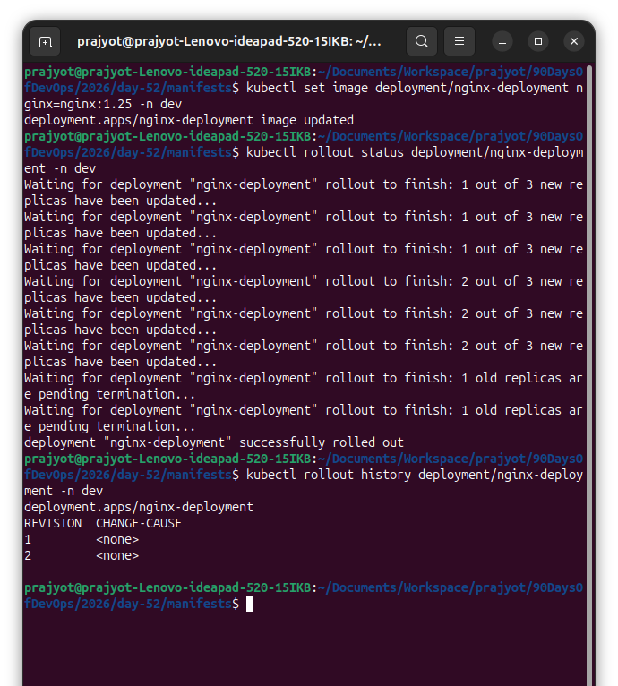

Now roll back to the previous version:
```bash
kubectl rollout undo deployment/nginx-deployment -n dev
kubectl rollout status deployment/nginx-deployment -n dev
```

Verify the image is back to the previous version:
```bash
kubectl describe deployment nginx-deployment -n dev | grep Image
```

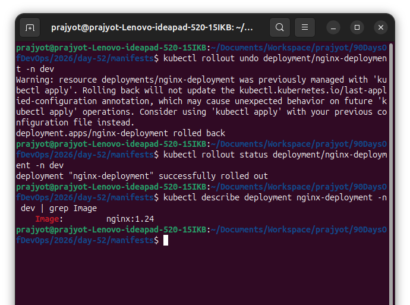

**Verify:** What image version is running after the rollback?
- After rollback Image Version is `nginx:1.24`
---

### Task 7: Clean Up
```bash
kubectl delete deployment nginx-deployment -n dev
kubectl delete pod nginx-dev -n dev
kubectl delete pod nginx-staging -n staging
kubectl delete namespace dev staging production
```

Deleting a namespace removes everything inside it. Be very careful with this in production.

```bash
kubectl get namespaces
kubectl get pods -A
```

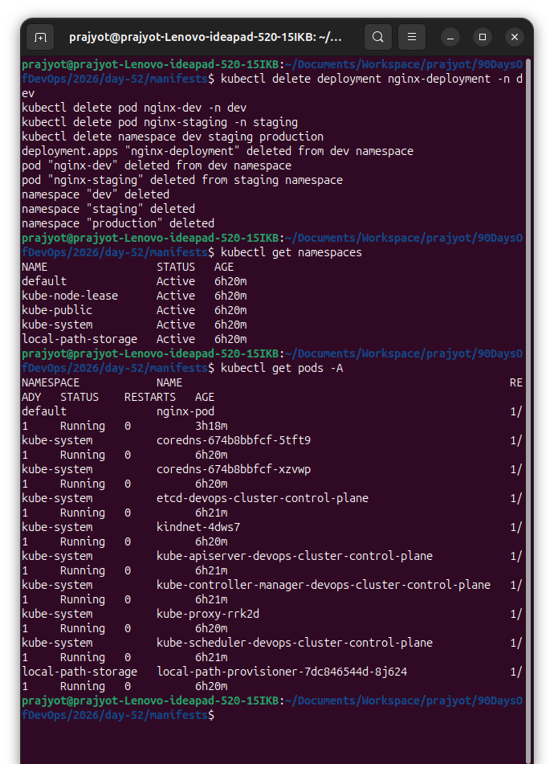

**Verify:** Are all your resources gone?
- Yes, all resources gone


---

**What namespaces are and why you would use them**
- Namespaces are like folders in Kubernetes that separate resources inside one cluster
- They are used to keep things organized and isolated (logical isolation) (e.g., stage,dev and prod don’t mix)


**Explaination of Deployment manifest**

- `apiVersion` & `kind` Defines the resource as a Deployment
- `metadata`Contains Deployment identity (name, namespace, labels)
- `spec` Main configuration of the Deployment
- `spec.replicas` Ensures 3 Pods are always running
- `spec.selector` Matches Pods with label app: nginx
- `spec.template` Blueprint used to create Pods
- `template.metadata` Labels assigned to Pods
- `template.spec` Pod-level configuration
- `containers` Defines container details (name, image)
- `ports` Exposes container port 80

**What happens when you delete a Pod managed by a Deployment vs a standalone Pod**

1. Pod managed by a Deployment:
 - Kubernetes automatically recreates a new pod to maintain the desired number of replicas.
 - The new pod gets a different name but keeps the same Deployment/ReplicaSet prefix.
 - Ensures the desired state is always met.

2. Standalone Pod (not managed by Deployment):
 - Kubernetes does NOT recreate it.
 - Once deleted, the pod is gone permanently.


**How scaling works (both imperative and declarative)**

1. `Imperative`: you directly tell Kubernetes how many replicas you want using a command.
2. `Declarative`: you update the Deployment manifest (YAML) with the desired replicas.

**How rolling updates and rollbacks work**

1. `Rolling Updates`
- Deployment updates its pod template (e.g., new container image).
- Kubernetes creates new pods with the updated spec.
- Old pods are terminated gradually as new pods become ready.

2. `Rollbacks`
- Deployment keeps a history of previous ReplicaSets.
- You trigger rollback to a previous revision.
- Kubernetes recreates pods from the old ReplicaSet while removing the current ones.
